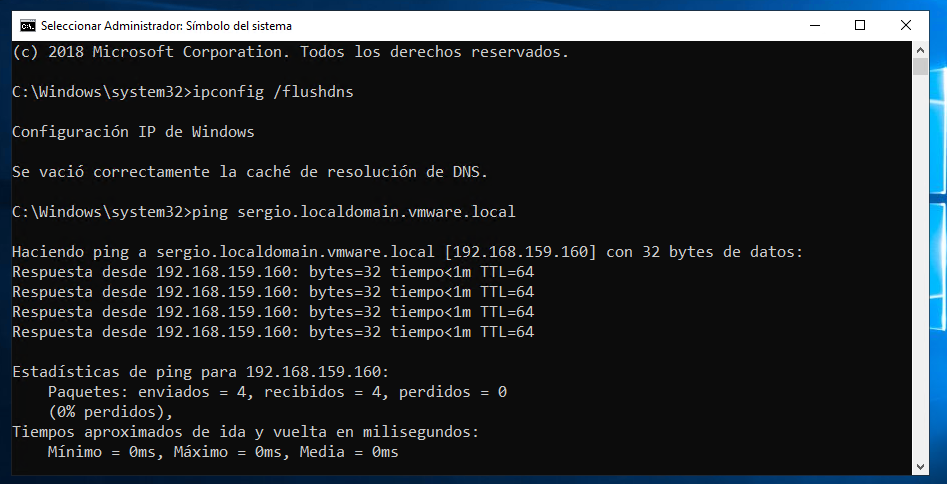
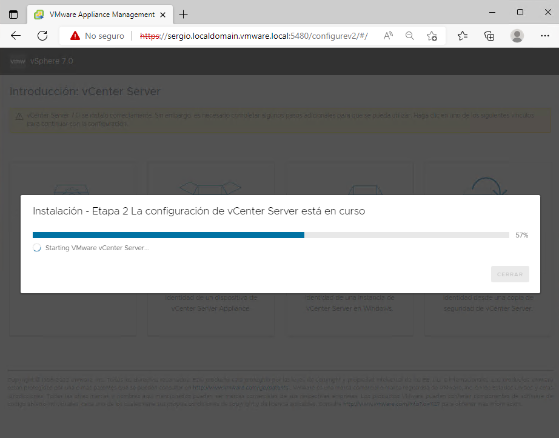

# Nube híbrida

La nube híbrida combina y unifica los servicios de nube pública y de nube privada de varios proveedores de nube para crear una infraestructura de TI única, flexible y rentable.

## ¿Qué es una nube híbrida?
La nube híbrida es una infraestructura de TI que conecta al menos una nube pública y al menos una nube privada, y proporciona orquestación, gestión y portabilidad de aplicaciones entre ellas para crear un entorno de nube único, flexible y óptimo para ejecutar las cargas de trabajo informáticas de una empresa.

### Nube privada con VMWARE 

#### Instalando vCenter 7.0

Antes de instalar el vcenter haga una entrada en el dns

Utilizaremos el OVF de vCenter 7.0 Appliance para desplegar el vCenter en una VMWare WorkStation:

Comenzará un asistente para la importación de vCenter appliance, deberá:

1 - Dar el nombre a la máquina virtual en el inventario de VMWare WorkStation y carpeta en el disco

2 - Seleccionar el tamaño del despliegue

3 - Realizar la configuración de la red

4 - Establecer la contraseña de SSO

5 - Establecer la contraseña de root

> **Y cuando aparezca la máquina virtual en el inventario de máquinas cambie la conexión de la red virtual para que se encuentren en la misma red virtual el DNS, los ESXi-x, y demás máquinas involucradas**

Esto dará inicio a la Fase 1, el tiempo medio de instalación es de unos 15 minutos

Hasta que no aparezca esto en la consola de vCenter no podrá continuar.

Revise si el vCenter Server da respuesta a ping (Si es necesario limpie la cache del DNS)

Navegue hasta el puerto 5480 para continuar con la implementación. (La fase 1 ha terminado)

Inicio de la fase 2.

Una vez instalado deberá entrar con SSO a:
administrator@your_domain_name / Password
